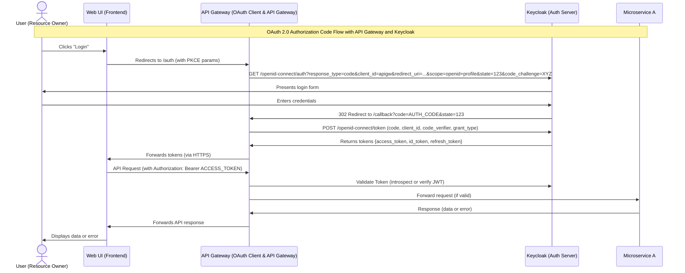

---

### Flow Explanation

- **User Authentication:**
  - The user initiates login from the Web UI, which redirects to the API Gateway.
  - The API Gateway manages the OAuth2 Authorization Code flow with Keycloak, including PKCE for security.
  - Keycloak presents its login form and authenticates the user.
  - Upon successful authentication, Keycloak returns an authorization code to the API Gateway, which exchanges it for tokens.
  - The API Gateway forwards the tokens to the Web UI.

- **API Requests:**
  - The Web UI sends API requests with the access token to the API Gateway.
  - The API Gateway validates the token with Keycloak (via introspection or JWT verification).
  - If valid, the API Gateway forwards the request to Microservice A.
  - Microservice A returns a response to the API Gateway.
  - The API Gateway forwards the response to the Web UI, which displays the result to the user.

- **No Direct Microservice Communication:**
  - Only Microservice A is present; all requests are routed through the API Gateway for clarity and security.

This flow ensures secure, centralized authentication and authorization, and a clear, maintainable architecture for your microservices system.