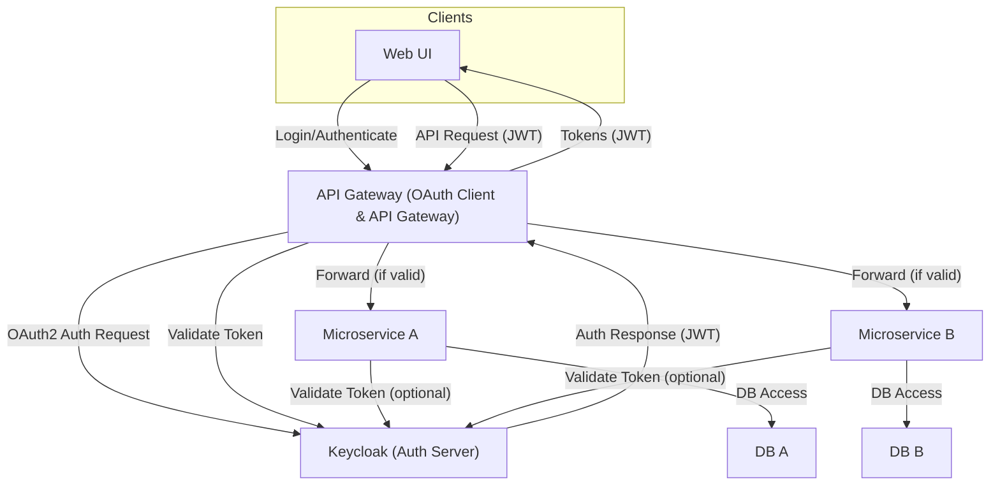

---

### Architecture Explanation

- **API Gateway (OAuth Client & API Gateway):**
  - This is a single component that acts both as the OAuth client (handling authentication with Keycloak) and as the API gateway (routing and securing requests to microservices).
  - There is no need to separate these into two gateways; one well-designed API Gateway can handle both authentication and request routing.
- **User Authentication:** The Web UI initiates authentication by connecting to the API Gateway, which manages the OAuth2 flow with Keycloak and returns tokens to the client.
- **API Requests:** The Web UI sends API requests with JWT tokens to the API Gateway. The gateway validates tokens with Keycloak and forwards valid requests to the appropriate microservice.
- **Microservice Communication:** Microservice A and Microservice B are independent and do not communicate directly in this design for clarity.
- **Database Access:** Each microservice accesses its own database only.
- **Optional Token Validation:** Microservices may optionally validate tokens with Keycloak for extra security, but the main validation is handled by the API Gateway.

This design is clean, efficient, and follows best practices for secure, scalable microservices architectures.