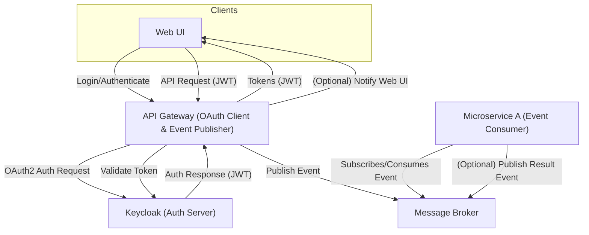

---

### Architecture Explanation

- **API Gateway (OAuth Client & Event Publisher):**
  - Handles authentication with Keycloak and issues tokens to the Web UI.
  - Publishes events to the message broker instead of making direct HTTP calls to microservices.
- **Message Broker:**
  - Decouples the API Gateway from Microservice A.
  - Delivers events asynchronously to subscribed microservices.
- **Microservice A (Event Consumer):**
  - Subscribes to relevant events from the broker and processes them.
  - Can publish result events if needed, which the API Gateway can consume to notify the Web UI.
- **Web UI:**
  - Authenticates and communicates only with the API Gateway.
  - Receives notifications or results via the API Gateway (using WebSockets, polling, or callbacks).

This event-driven architecture enables loose coupling, scalability, and asynchronous processing, while maintaining secure authentication and authorization with Keycloak.
