# Project Workflow: University ERP Microservices (FastAPI)

## Overview
This project is a microservices-based University ERP system built with FastAPI. It consists of three main management modules:
- Student Management
- Faculty Management
- Library Management
Each module is a FastAPI app, mounted under a main FastAPI application. The system uses a gateway for routing and redirection, and each module is organized with controllers, services, repositories, and models.

---

## Main Application (`main.py`)
- **Mounts**: `/ch04/student`, `/ch04/faculty`, `/ch04/library` (each a FastAPI app)
- **Includes**: `/ch04/university/{portal_id}` (gateway route)
- **Middleware**: Logs all requests and responses
- **Exception Handlers**: Redirects to the appropriate portal on custom exceptions

---

## Gateway (`gateway/api_router.py`)
- **Function**: `call_api_gateway` checks `portal_id` and raises a redirect exception for student, faculty, or library portals.
- **Custom Exceptions**: Used for redirection in the main app.

---

## Student Management (`student_mgt/`)
- **App**: `student_app` (FastAPI)
- **Controllers**:
  - `admin.py`: Signup, login, and approval for students
  - `assignments.py`: List and submit assignments (calls faculty assignment endpoints)
  - `reservations.py`: Access and reserve books (calls library endpoints)
- **Services/Repositories**: Handle business logic and data access for students, signup, login
- **Models**: Data and request models for students, assignments, and library

---

## Faculty Management (`faculty_mgt/`)
- **App**: `faculty_app` (FastAPI)
- **Controllers**:
  - `admin.py`: Signup, login, and approval for faculty
  - `assignments.py`: Create/list assignments, receive student submissions
  - `books.py`: List/request/return books (calls library endpoints)
- **Services/Repositories**: Handle business logic and data access for faculty, assignments, signup, login
- **Models**: Data and request models for faculty, assignments, and library

---

## Library Management (`library_mgt/`)
- **App**: `library_app` (FastAPI)
- **Controllers**:
  - `admin.py`: Add, list, delete, update books
  - `management.py`: Book requests, issuance, reservations
- **Services/Repositories**: Handle business logic and data access for books, issuance, reservations
- **Models**: Data and request models for books, issuance, reservations

---

## Configuration (`configuration/`)
- **config.py**: Pydantic settings for each module and server
- **erp_settings.properties**: Environment variables for server settings

---

## Workflow Diagram (Textual)

1. **User accesses** `/ch04/university/{portal_id}`
2. **Gateway** checks `portal_id` and redirects to the correct portal:
   - 1: `/ch04/student/index`
   - 2: `/ch04/faculty/index`
   - 3: `/ch04/library/index`
3. **Each portal** exposes its own API endpoints for management tasks:
   - Student: signup, login, assignments, book reservations
   - Faculty: signup, login, assignments, book requests
   - Library: book management, requests, issuance
4. **Controllers** call their respective services and repositories for business logic and data access
5. **Inter-module communication** (e.g., student assignment submission to faculty, book requests to library) is done via HTTP requests between services
6. **Logging** and **exception handling** are managed centrally in the main app

---

## Sequence Diagram (Mermaid)

```mermaid
sequenceDiagram
    participant User
    participant Gateway as Main App/Gateway
    participant Student as Student App
    participant Faculty as Faculty App
    participant Library as Library App

    User->>Gateway: GET /ch04/university/{portal_id}
    Gateway->>Gateway: call_api_gateway(portal_id)
    alt Student Portal (portal_id == 1)
        Gateway-->>User: Redirect /ch04/student/index
        User->>Student: GET /ch04/student/index
        Student->>Student: Load config (StudentSettings, ServerSettings)
        User->>Student: POST /ch04/student/account/signup
        Student->>Student: Create Signup (SignupReq, Signup)
        Student->>Student: StudentSignupService.add_signup()
        User->>Student: GET /ch04/student/account/signup/approved
        Student->>Student: StudentSignupService.get_signup()
        Student->>Student: Create Login (Login)
        Student->>Student: StudentLoginService.add_student_login()
        User->>Student: POST /ch04/student/login/account
        Student->>Student: StudentLoginService.login()
        User->>Student: GET /ch04/student/assignment/list
        Student->>Faculty: GET /ch04/faculty/assignments/list
        Faculty->>Faculty: AssignmentService.list_assignment()
        User->>Student: POST /ch04/student/assignment/submit
        Student->>Faculty: POST /ch04/faculty/assignments/student/submit
        Faculty->>Faculty: AssignmentSubmissionService.add_assigment()
        User->>Student: GET /ch04/student/access/book
        Student->>Library: GET /ch04/library/book/list
        Library->>Library: BookService.list_book()
        User->>Student: GET /ch04/student/reserve/book
        Student->>Library: POST /ch04/library/book/issuance
        Library->>Library: BookIssuanceService.add_book_release()
    else Faculty Portal (portal_id == 2)
        Gateway-->>User: Redirect /ch04/faculty/index
        User->>Faculty: GET /ch04/faculty/index
        Faculty->>Faculty: Load config (FacultySettings, ServerSettings)
        User->>Faculty: POST /ch04/faculty/account/signup
        Faculty->>Faculty: Create Signup (SignupReq, Signup)
        Faculty->>Faculty: FacultySignupService.add_signup()
        User->>Faculty: GET /ch04/faculty/account/signup/approved
        Faculty->>Faculty: FacultySignupService.get_signup()
        Faculty->>Faculty: Create Login (Login)
        Faculty->>Faculty: FacultyLoginService.add_faculty_login()
        User->>Faculty: POST /ch04/faculty/login/account
        Faculty->>Faculty: FacultyLoginService.login()
        User->>Faculty: GET /ch04/faculty/assignments/list
        Faculty->>Faculty: AssignmentService.list_assignment()
        User->>Faculty: POST /ch04/faculty/assignments/faculty
        Faculty->>Faculty: AssignmentService.add_assignment()
        User->>Faculty: POST /ch04/faculty/assignments/student/workbin
        Faculty->>Faculty: AssignmentSubmissionService.create_workbin()
        User->>Faculty: GET /ch04/faculty/books/access/list
        Faculty->>Library: GET /ch04/library/book/list
        Library->>Library: BookService.list_book()
        User->>Faculty: GET /ch04/faculty/books/request/list
        Faculty->>Library: GET /ch04/library/book/request/list
        Library->>Library: BookRequestService.list_book_request()
        User->>Faculty: POST /ch04/faculty/books/request/borrow
        Faculty->>Library: POST /ch04/library/book/request
        Library->>Library: BookRequestService.add_book_request()
        User->>Faculty: GET /ch04/faculty/books/issuance/list
        Faculty->>Library: GET /ch04/library/book/issuance/list
        Library->>Library: BookIssuanceService.list_issuances()
        User->>Faculty: POST /ch04/faculty/books/returning
        Faculty->>Library: POST /ch04/library/book/issuance/return
        Library->>Library: BookIssuanceService.return_book()
    else Library Portal (portal_id == 3)
        Gateway-->>User: Redirect /ch04/library/index
        User->>Library: GET /ch04/library/index
        Library->>Library: Load config (LibrarySettings)
        User->>Library: POST /ch04/library/book/add
        Library->>Library: BookService.add_book()
        User->>Library: GET /ch04/library/book/list
        Library->>Library: BookService.list_book()
        User->>Library: DELETE /ch04/library/book/list
        Library->>Library: BookService.remove_book()
        User->>Library: PATCH /ch04/library/book/update
        Library->>Library: BookService.update_book()
        User->>Library: POST /ch04/library/book/request
        Library->>Library: BookRequestService.add_book_request()
        User->>Library: POST /ch04/library/book/request/list
        Library->>Library: BookRequestService.list_book_request()
        User->>Library: POST /ch04/library/book/issuance
        Library->>Library: BookIssuanceService.add_book_release()
        User->>Library: GET /ch04/library/book/issuance/list
        Library->>Library: BookIssuanceService.list_issuances()
    end
    Note over Gateway: All modules log requests and handle exceptions centrally
```

---

### Sequence Diagram Explanation

This sequence diagram illustrates the end-to-end workflow for all three portals (Student, Faculty, Library) in the University ERP system. Each scenario is continuous and covers all major endpoints, models, and classes involved:

#### 1. Student Portal (portal_id == 1)
- The user is redirected to `/ch04/student/index`, where configuration is loaded using `StudentSettings` and `ServerSettings`.
- Student signup and login use `SignupReq`, `Signup`, `Login` models and the `StudentSignupService` and `StudentLoginService` classes.
- Assignment listing and submission interact with the Faculty App via HTTP, using `AssignmentRequest` and `Assignment` models, and `AssignmentService` and `AssignmentSubmissionService` classes.
- Book access and reservation interact with the Library App, using `BookIssuanceReq` and `BookService`, `BookIssuanceService` classes.

#### 2. Faculty Portal (portal_id == 2)
- The user is redirected to `/ch04/faculty/index`, loading `FacultySettings` and `ServerSettings`.
- Faculty signup and login use `SignupReq`, `Signup`, `Login` models and the `FacultySignupService` and `FacultyLoginService` classes.
- Assignment creation, listing, and workbin management use `AssignmentRequest`, `Assignment`, and `AssignmentService`, `AssignmentSubmissionService` classes.
- Book access, request, issuance, and return interact with the Library App, using `BookRequestReq`, `BookIssuanceReq`, `BookReturnReq` models and `BookService`, `BookRequestService`, `BookIssuanceService` classes.

#### 3. Library Portal (portal_id == 3)
- The user is redirected to `/ch04/library/index`, loading `LibrarySettings`.
- Book management (add, list, delete, update) uses the `Book` model and `BookService` class.
- Book requests and issuance use `BookRequestReq`, `BookIssuanceReq` models and `BookRequestService`, `BookIssuanceService` classes.

#### Notes
- All endpoints are shown in the diagram, and each step references the main models and service classes involved.
- Inter-module communication (e.g., student to faculty, faculty to library) is done via HTTP requests.
- All modules log requests and handle exceptions centrally in the main app.
- The workflow is continuous for each portal, making it easy to follow the user journey and backend processing.

---

## API Endpoint Testing Order

Below is a recommended, well-organized order for testing all endpoints in the University ERP system. This order follows the logical workflow for each portal, ensuring dependencies are respected and the system is tested comprehensively.

---

### 1. Student Portal Endpoints

1. **GET** `/ch04/student/index`  
   _Check portal configuration and information._
2. **POST** `/ch04/student/account/signup`  
   _Register a new student account._
3. **GET** `/ch04/student/account/signup/approved?sign_id={id}`  
   _Approve student signup and create login credentials._
4. **POST** `/ch04/student/login/account`  
   _Student login with username and password._
5. **GET** `/ch04/student/assignment/list`  
   _List all available assignments for the student._
6. **POST** `/ch04/student/assignment/submit`  
   _Submit an assignment for review._
7. **GET** `/ch04/student/access/book`  
   _List all available books in the library._
8. **GET** `/ch04/student/reserve/book`  
   _Reserve a book from the library._

---

### 2. Faculty Portal Endpoints

1. **GET** `/ch04/faculty/index`  
   _Check portal configuration and information._
2. **POST** `/ch04/faculty/account/signup`  
   _Register a new faculty account._
3. **GET** `/ch04/faculty/account/signup/approved?sign_id={id}`  
   _Approve faculty signup and create login credentials._
4. **POST** `/ch04/faculty/login/account`  
   _Faculty login with username and password._
5. **GET** `/ch04/faculty/assignments/list`  
   _List all assignments created by faculty._
6. **POST** `/ch04/faculty/assignments/faculty`  
   _Create a new assignment for students._
7. **POST** `/ch04/faculty/assignments/student/workbin`  
   _Create a workbin to organize student submissions for an assignment._
8. **GET** `/ch04/faculty/books/access/list`  
   _List all books available in the library._
9. **GET** `/ch04/faculty/books/request/list`  
   _List all book requests made by faculty._
10. **POST** `/ch04/faculty/books/request/borrow`  
    _Request to borrow a book from the library._
11. **GET** `/ch04/faculty/books/issuance/list`  
    _List all book issuances to faculty._
12. **POST** `/ch04/faculty/books/returning`  
    _Return a borrowed book to the library._

---

### 3. Library Portal Endpoints

1. **GET** `/ch04/library/index`  
   _Check portal configuration and information._
2. **POST** `/ch04/library/book/add`  
   _Add a new book to the library collection._
3. **GET** `/ch04/library/book/list`  
   _List all books in the library._
4. **DELETE** `/ch04/library/book/list`  
   _Delete a book from the library._
5. **PATCH** `/ch04/library/book/update`  
   _Update information for an existing book._
6. **POST** `/ch04/library/book/request`  
   _Add a new book request (from students or faculty)._ 
7. **POST** `/ch04/library/book/request/list`  
   _List all book requests._
8. **POST** `/ch04/library/book/issuance`  
   _Approve and issue a book to a requester._
9. **GET** `/ch04/library/book/issuance/list`  
   _List all book issuances._
10. **POST** `/ch04/library/book/issuance/return`  
    _Process the return of a borrowed book._

---

**Testing Tips:**
- Always start with the `/index` endpoint for each portal to verify configuration.
- Follow the registration and login flow before testing protected or dependent endpoints.
- For endpoints requiring IDs (e.g., `sign_id`), use the IDs returned from previous steps.
- Test inter-module flows (e.g., assignment submission, book requests) after verifying basic CRUD operations.

This order ensures a smooth and logical testing process for all features and workflows in the system.

---

## Notes
- All modules are loosely coupled and communicate via HTTP APIs
- Each module can be developed, tested, and deployed independently
- Configuration is managed via Pydantic and environment files

---

*Generated on July 4, 2025*
