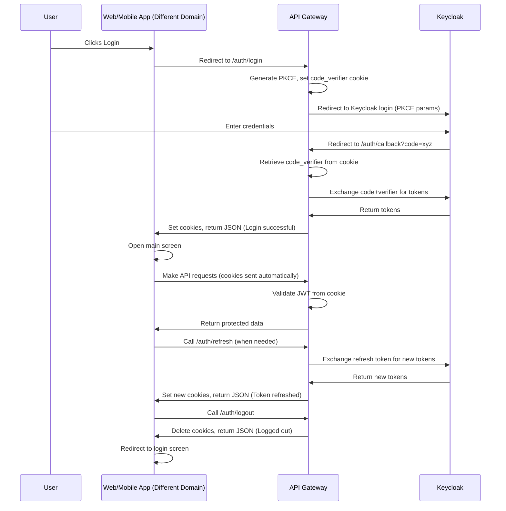

# Authentication Scenario: Step-by-Step Flow (Web/Mobile App, Different Domain)

## 1. User Initiates Login
- User opens the web/mobile app (e.g., `https://myapp.com`).
- App displays a login button.
- User clicks the login button.

## 2. App Redirects to Gateway Login Endpoint
- App sends the user to the API Gateway's `/auth/login` endpoint (e.g., `https://api.mycompany.com/auth/login`).
- The request is a browser redirect (for web) or a webview redirect (for mobile).

## 3. Gateway Prepares PKCE and Redirects to Keycloak
- `/auth/login` generates a PKCE code verifier and challenge.
- Stores the code verifier in a secure, HTTP-only cookie.
- Builds the Keycloak authorization URL with PKCE parameters.
- Redirects the user to Keycloak's login page.

## 4. User Logs in on Keycloak
- User enters credentials on Keycloak (`https://keycloak.mycompany.com`).
- Keycloak authenticates the user.

## 5. Keycloak Redirects to Gateway Callback
- After successful login, Keycloak redirects the browser/webview to `/auth/callback` on the API Gateway, with an authorization code.
- Example: `https://api.mycompany.com/auth/callback?code=xyz`

## 6. Gateway Exchanges Code for Tokens
- `/auth/callback` retrieves the code verifier from the cookie.
- Sends a POST request to Keycloak's token endpoint with the code and code verifier.
- Receives access and refresh tokens from Keycloak.

## 7. Gateway Sets Cookies and Responds
- Sets `access_token` and `refresh_token` in secure, HTTP-only cookies.
- Returns a JSON response: `{"message": "Login successful"}`.
- (Optionally, can return tokens in JSON for SPA/mobile clients if uncommented in code.)

## 8. App Receives Response
- Browser/mobile app receives the response from `/auth/callback`.
- Cookies are set automatically by the browser/webview.
- App checks for `{"message": "Login successful"}` and opens the main screen.

## 9. App Makes Authenticated Requests
- For every API request, browser/webview automatically sends cookies to the gateway.
- Gateway validates the JWT from the cookie for protected endpoints.
- If valid, request is processed; if not, returns 401.

## 10. Token Refresh
- When access token expires, app calls `/auth/refresh` on the gateway.
- Gateway uses the refresh token from the cookie to get new tokens from Keycloak.
- Sets new tokens in cookies and returns `{"message": "Token refreshed"}`.

## 11. Logout
- User clicks logout in the app.
- App calls `/auth/logout` on the gateway.
- Gateway deletes the cookies and returns `{"message": "Logged out"}`.
- App redirects user to login screen.

---

# Sequence Diagram

---

## Double-Check on Code
- PKCE is generated and stored in a secure cookie.
- All redirects and token exchanges use secure endpoints.
- Cookies are set as HTTP-only and secure, not accessible to JavaScript.
- CORS is enabled for cross-domain requests.
- Tokens are not exposed in JSON unless code is uncommented for SPA/mobile.
- Refresh and logout endpoints are present and work as described.
- Frontend must check for `{"message": "Login successful"}` and handle navigation.
- All steps are covered and will work for web/mobile apps on different domains.
