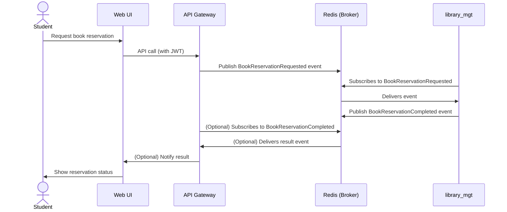

# Example Event Flow

This document provides a step-by-step example of an event-driven flow in the system, using the book reservation use case.

## Use Case: Student Reserves a Book

1. **User Action:**
   - Student uses the Web UI to request a book reservation.
2. **API Gateway:**
   - Authenticates the student (via Keycloak).
   - Publishes a `BookReservationRequested` event to the `book.reservation.requested` Redis channel.
3. **library_mgt Microservice:**
   - Subscribes to the `book.reservation.requested` channel.
   - Processes the reservation (checks availability, updates records).
   - Publishes a `BookReservationCompleted` event to the `book.reservation.completed` channel.
4. **API Gateway (Optional):**
   - Subscribes to the `book.reservation.completed` channel.
   - Notifies the Web UI of the reservation result (via WebSocket, polling, or callback).

## Sequence Diagram

## Reference
- This flow is inspired by the book and the example codebase.
